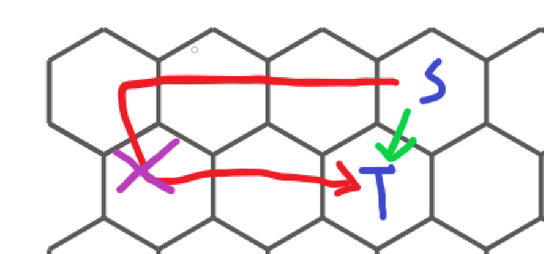

# 2021 NTHU NCPC pre Contest Hive

## 題目

http://adalab.cs.nthu.edu.tw/contest/26/problem/W2-5

有一個由六邊形格子所組成的圖，每個格子上都會有一些點數，然後給你兩組起點和終點，問你這兩組點連線且連線不相交的情況下最小點數和是多少，如果無解請輸出$-1$

## Solution

這題的官解是輪廓線DP，但其實我們可以用一些剪枝的技巧來AC掉這題

能越快走到的就先走，不要繞遠路。大概就是像下面這張圖一樣



而剪的方式就是紀錄每個格子的degree，如果他相鄰格子的degree數總和$\ge 2$的話就可以不用走了，就像圖中畫叉叉的地方一樣，因為那樣走一定會是繞遠路

而其他的小剪枝像是目前答案$\gt$目前找到的最小值就可以不用再走了

枚舉完第一條後第二條就可以用其他最短路算法去求，這裡是用dijkstra

## AC code

```cpp
#include<bits/stdc++.h>
#define IOS ios::sync_with_stdio(0),cin.tie(0),cout.tie(0)
#define endl '\n'
#define pii pair<int,int>
#define F first
#define S second
using namespace std;
const int inf = 1e9+7;
int ans = inf;
int n,m;
int mp[105][105] = {},vis[105][105] = {},deg[105][105] = {};
int dx[6] = {-1,0,1,1,0,-1};
int dy[6] = {1,2,1,-1,-2,-1};
pii f(int x,int y){
	return make_pair(x,(y-1)*2+(x&1)+(x%2==0?2:0));
}
int dijkstra(int sx,int sy,int ex,int ey){
	int dis[105][105] = {},vis2[105][105] = {};
	memset(dis,0x3f3f3f3f,sizeof(dis));
	dis[sx][sy] = mp[sx][sy];
	priority_queue<pair<int,pii>,vector<pair<int,pii>>,greater<pair<int,pii>>>pq;
	pq.push({dis[sx][sy],{sx,sy}});
	while(!pq.empty()){
		auto [x,y] = pq.top().S;
		pq.pop();
		if(vis[x][y] or vis2[x][y])continue;
		vis2[x][y] = 1;
		for(int i = 0;i<6;++i){
			int nx = x+dx[i],ny = y+dy[i];
			if(nx<1 or ny<1 or nx>n or ny>2*m)continue;
			if(vis[nx][ny] or vis2[nx][ny])continue;
			if(dis[nx][ny]>dis[x][y]+mp[nx][ny]){
				dis[nx][ny] = dis[x][y]+mp[nx][ny];
				pq.push({dis[nx][ny],{nx,ny}});
			}
		}
	}
	return dis[ex][ey];
}
void dfs(int x,int y,int ex,int ey,int dis,int sx,int sy,int ex2,int ey2){
	if(dis>ans)return;
	if(x==ex and y==ey){
		ans = min(ans,dis+dijkstra(sx,sy,ex2,ey2));
		return;
	}
	for(int i = 0;i<6;++i){
		int nx = x+dx[i],ny = y+dy[i];
		if(nx<1 or ny<1 or nx>n or ny>2*m)continue;
		deg[nx][ny]++;
	}
	for(int i = 0;i<6;++i){
		int nx = x+dx[i],ny = y+dy[i];
		if(nx<1 or ny<1 or nx>n or ny>2*m)continue;
		if(vis[nx][ny])continue;
		if(deg[nx][ny]>=2)continue;
		vis[nx][ny] = 1;
		dfs(nx,ny,ex,ey,dis+mp[nx][ny],sx,sy,ex2,ey2);
		vis[nx][ny] = 0;
	}
	for(int i = 0;i<6;++i){
		int nx = x+dx[i],ny = y+dy[i];
		if(nx<1 or ny<1 or nx>n or ny>2*m)continue;
		deg[nx][ny]--;
	}
}
void solve(){
	ans = inf;
	int x[5] = {},y[5] = {};
	cin>>n>>m;
	for(int i = 1;i<=4;++i){
		cin>>x[i];
		cin>>y[i];
		auto [nx,ny] = f(x[i],y[i]);
		x[i] = nx,y[i] = ny;
	}
	for(int i = 1;i<=n;++i){
		for(int j = 1;j<=m;++j){
			auto [nx,ny] = f(i,j);
			cin>>mp[nx][ny];
		}
	}
	vis[x[1]][y[1]] = 1;
	dfs(x[1],y[1],x[2],y[2],mp[x[1]][y[1]],x[3],y[3],x[4],y[4]);
	if(ans>=inf)cout<< -1 <<endl;
	else cout<<ans<<endl;
	vis[x[1]][y[1]] = 0;
}
int main(){
	IOS;
	int t;
	cin>>t;
	while(t--){
		solve();
	}
}
```

