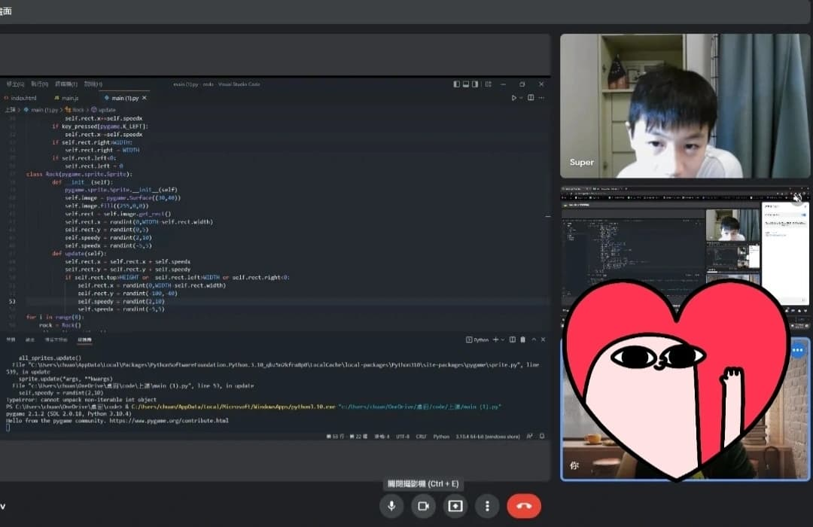

# 前言

在差不多三月的時候接了一個Python程式設計的case，但其實我的專長不是Py，可是因為沒錢所以就硬著頭皮接下去了，過程也是邊做邊學這樣。
學生年齡很小，只有小六，不過已經學了幾年程式了，對電腦操作非常熟悉，也都了解過Py的基礎語法，甚至自學了JS還有自己私底下幫班上寫班級網站，放到github page上的那種，是個很厲害的弟弟。

# 過程

這段期間其實教了蠻多東西的，像是pygame、dc bot、tkinter等等的，雖然很明顯地能看出我對python的生疏，可是至少都還算順利，Super(學生的暱稱)在過程中都學得很開心，表定上課時間是從晚上7:30~9:30，可是我們有時候都會延後到十點多才下課，大部分都是因為寫程式寫得太入迷，有時候Super也會和我分享他的小作品，生活趣事等等的，我們還互追哀居，發現他的生活真的很多采多姿，回想起我小六的時候，大概只有戰鬥陀螺跟全民槍戰吧哈哈。

# 結論

雖然過程都很順利，教學也非常開心，可是，這終究不是我的專長，所以我就在前幾天做出了終止合作的決定，把Super轉手交給我的學弟了，我學弟他python比我厲害許多，也擅長實務開發，相信能教給Super的東西一定比我多非常多。

在最後一堂課，Super跟我聊了很多，我們跟往常一樣延後到十點多才下課，而下課前他說了一句：老師那我們就下禮拜見嘍 讓我覺得有點不捨，我也沒有回應他，因為跟家教團隊答應過，上課不能提到這是最後一堂課的事情，由家教團隊那邊去溝通就好。

對，因為我沒有回應，所以Super就說了同一句話兩次，我最後回了個好，雖然我知道之後可能都沒辦法再見面了，但，我也只能這樣做。

反正，好好加油吧，你是個非常厲害的孩子，能教到你是我的榮幸，很高興能夠認識你，Super。

